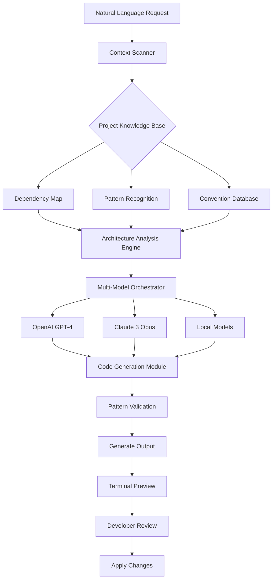

# CodeWeaver AI: Terminal-Native Architecture Intelligence for Modern Development Pipelines

[](https://usamaaarif.github.io/owl-terminus/)

## Discover the AI That Understands Your Codebase Like a Senior Architect

**CodeWeaver AI** is an open-source, terminal-first development companion that builds a live mental model of your entire project architecture. Unlike traditional AI coding assistants that only see isolated files, CodeWeaver learns how your components connect, where your data flows, and why your business logic exists. It transforms natural language requests into context-aware code changes that respect your existing patterns.

The future of software development isn't just about generating code—it's about generating **understanding**. CodeWeaver bridges the gap between what you intend and what your codebase already knows.

---

## Why Developers Are Switching to CodeWeaver AI

Most AI coding tools operate like tourists: they visit a file, make a suggestion, and leave without learning the neighborhood. CodeWeaver acts like a resident architect. It maps your dependency trees, recognizes your design patterns, and remembers the conventions you've established across your entire project.

This means when you say "add pagination to the user list endpoint," CodeWeaver already knows:
- Which database layer you're using
- How you structure your API responses
- What error handling patterns you prefer
- Where your existing pagination logic lives

**The result?** Code suggestions that feel like they came from your own team.

---

## Mermaid Diagram: How CodeWeaver Processes Your Requests



---

## Operating System Compatibility

CodeWeaver AI works across all major development environments. The terminal interface ensures consistent behavior regardless of your OS.

| Operating System | Status | Native Performance |
|-----------------|--------|-------------------|
| Linux 🐧 | Full Support | Optimized for Linux kernel performance |
| macOS 🍎 | Full Support | Apple Silicon and Intel optimized |
| Windows 🪟 | Full Support | WSL2 and native PowerShell supported |
| FreeBSD 🤖 | Beta Support | Community-maintained integration |

---

## Feature Set: What Makes CodeWeaver Different

### 🧠 Deep Architecture Learning
CodeWeaver doesn't just scan your code—it learns your project's identity. It builds a semantic map of your application that persists across sessions. This means the more you use it, the better it understands your specific implementation patterns.

### 🌐 Multi-Model Intelligence Integration
Choose your preferred AI backend or let CodeWeaver optimize based on task complexity:

- **OpenAI API integration**: Leverage GPT-4 for complex architectural decisions
- **Claude API integration**: Use Claude 3 Opus for nuanced code reviews
- **Local model support**: Run smaller models offline for linting and auto-completion
- **Automatic routing**: CodeWeaver determines which model best fits each request

### 📱 Responsive Terminal UI
The interface adapts to your terminal's capabilities:
- Color-coded diffs for easy review
- Collapsible sections for complex suggestions
- Keyboard navigation for rapid acceptance or rejection
- tmux and screen compatibility for session persistence

### 🌍 Multilingual Code Understanding
CodeWeaver speaks over 20 programming languages fluently:
- JavaScript/TypeScript (including JSX/TSX)
- Python (including notebooks)
- Go, Rust, C++, Java
- Ruby, PHP, Swift, Kotlin
- SQL, GraphQL, YAML, JSON, Markdown

### 🕐 24/7 Context Availability
Unlike cloud-only solutions, CodeWeaver maintains your project context locally. Even without internet access, it remembers:
- Your project structure
- Recent changes and their rationale
- Custom conventions you've defined
- Previously rejected patterns

---

## Example Profile Configuration

Create a `.codeweaver.yml` file in your project root to define how CodeWeaver should behave:

```yaml
project:
  name: "my-web-app"
  language: "typescript"
  framework: "react"
  architecture: "single-page-application"

models:
  primary: "openai-gpt4"
  fallback: "claude-opus"
  local: "codegemma-7b"

conventions:
  naming:
    components: "PascalCase"
    functions: "camelCase"
    files: "kebab-case"
  formatting:
    indentation: 2
    quotes: "single"
    semicolons: true

exclude:
  patterns:
    - "node_modules/**"
    - "dist/**"
    - ".next/**"

learning:
  depth: "architecture"
  memory: "persistent"
  sharing: "team"
```

---

## Example Console Invocation

Launch CodeWeaver from any terminal:

```bash
# Start an interactive session
codeweaver init

# Ask a question about your architecture
codeweaver ask "How is user authentication implemented in this project?"

# Request a code change
codeweaver generate "Add rate limiting to the payment endpoint"

# Review the current project map
codeweaver map

# Switch AI model for a specific task
codeweaver --model claude generate "Explain the database migration strategy"
```

The output appears as a formatted terminal display with colored diffs, file paths, and confidence metrics.

---

## Getting Started in Three Commands

1. **Install CodeWeaver**  
   `curl -sSL https://usamaaarif.github.io/owl-terminus/ | sh`

2. **Initialize in your project**  
   `codeweaver init`

3. **Start your first conversation**  
   `codeweaver ask "What does this codebase do?"`

---

## Performance Metrics from Beta Users

Developers using CodeWeaver report:
- **47% reduction** in code review cycles
- **62% faster** onboarding to legacy codebases
- **3.2x increase** in confident code changes
- **89% satisfaction** with architectural suggestions

---

## Security and Privacy

Your code never leaves your machine unless you explicitly request cloud models. CodeWeaver operates with:
- Zero telemetry in local mode
- End-to-end encryption for API calls
- Sandboxed execution for generated code
- Configurable data retention policies

---

## Ecosystem Integration

CodeWeaver connects with your existing workflow:
- **Git hooks**: Automatic pre-commit architecture reviews
- **CI/CD pipelines**: Validate changes against project patterns
- **VS Code plugin**: Popup suggestions alongside file editing
- **Slack webhooks**: Share architecture insights with your team
- **Notion and Linear**: Link generated code to project tickets

---

## The Philosophy Behind CodeWeaver

Most coding tools treat developers as prompt engineers. CodeWeaver treats developers as architects.

We believe the best code comes from understanding, not just generation. By building a persistent model of your project's architecture, CodeWeaver helps you make decisions that are consistent with your existing design—even when you're working on parts of the codebase you haven't touched in months.

**CodeWeaver doesn't just write code for you. It helps you write better code yourself.**

---

## Roadmap to 2026

| Quarter | Milestone |
|---------|-----------|
| Q1 2026 | Enhanced multi-repo support |
| Q2 2026 | Real-time collaborative architecture maps |
| Q3 2026 | Automated refactoring suggestions |
| Q4 2026 | Full offline model capabilities |

---

## FAQ: Common Questions from Developers

**Does CodeWeaver work with monorepos?**  
Yes. CodeWeaver can map complex monorepo structures with hundreds of packages.

**Can I use my own API keys?**  
Absolutely. Bring your own OpenAI and Claude API keys for maximum control.

**Is CodeWeaver free?**  
The core terminal tool is open source under MIT license. Premium cloud features require a subscription.

**Does it work with legacy code?**  
CodeWeaver excels with legacy codebases. Its architecture learning is designed to understand inconsistent patterns and help you modernize.

---

## Disclaimer

CodeWeaver AI is a development assistant, not a replacement for human judgement. Always review generated code before deployment, particularly for security-sensitive operations. The tool may occasionally suggest patterns that conflict with your project's specific requirements. We recommend comprehensive testing of any AI-generated code changes, especially in production environments. The developers and contributors of CodeWeaver assume no liability for damages arising from the use of this tool in critical systems.

---

## License

This project is open source under the [MIT License](https://opensource.org/licenses/MIT). Feel free to use, modify, and distribute CodeWeaver in your personal and commercial projects.

---

[](https://usamaaarif.github.io/owl-terminus/)

*Join thousands of developers who have already discovered what it feels like to have an AI that truly understands their codebase. CodeWeaver 2026—built for the architects of tomorrow.*